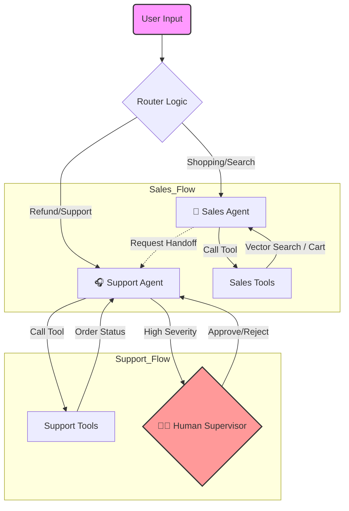

# 🛒 SmartShop Elite: Autonomous Retail Agent

[](https://python.langchain.com/)
[](https://deepmind.google/technologies/gemini/)
[](https://www.trychroma.com/)

A Multi-Agent System designed to handle E-commerce operations, featuring semantic product search (RAG), persistent shopping carts, and automated customer support escalation.

## 🚀 Key Features
*   **Multi-Agent Orchestration:** Uses `LangGraph` to manage state transitions between a **Sales Agent** (Discovery) and a **Support Agent** (Refunds/Issues).
*   **RAG (Retrieval-Augmented Generation):** Semantic search over 50,000 products using `ChromaDB` and `Sentence-Transformers`.
*   **Human-in-the-Loop:** Automated handoff logic triggers a "Supervisor" interrupt for sensitive actions (like refunds).
*   **Tool Calling:** Agents autonomously use Python tools to query SQL-like data, manage cart state, and fetch live info.

## 🛠️ Architecture
The system relies on a **StateGraph** architecture:
1.  **Router:** Analyzing intent to dispatch to Sales or Support.
2.  **Sales Node:** Handles queries like "Find gluten-free bread" or "Add to cart".
3.  **Support Node:** Handles complaints. If severity is high, it pauses execution for human review.



## 💻 Tech Stack
*   **Orchestration:** LangGraph, LangChain
*   **LLM:** Google Gemini 2.0 Flash
*   **Database:** ChromaDB (Vector), Pandas (Structured)
*   **Interface:** Streamlit
*   **Environment:** Linux (WSL2) + CUDA Acceleration

## 🔧 Installation

### 1. Clone the repository
```bash
git clone https://github.com/clezcano/LangGraph-Retail-Assistant.git
cd LangGraph-Retail-Assistant
```

### 2. Install dependencies
It is recommended to use a virtual environment to avoid conflicts.
```bash
python3 -m venv venv
source venv/bin/activate  # On Windows use: venv\Scripts\activate
pip install -r requirements.txt
```

### 3. Set up environment variables
The system requires a Google Gemini API key to function.
```bash
# Create the .env file
touch .env

# Open it and add your key in this format:
# GOOGLE_API_KEY="YOUR_GOOGLE_API_KEY"
```

### 4. Run the ETL Pipeline
This process downloads the raw grocery dataset and builds the Vector Database (Embeddings) for semantic search.
```bash
# Step A: Download CSVs
python3 download_dataset.py

# Step B: Build Vector Index (ChromaDB)
# Note: This uses the 'all-MiniLM-L6-v2' model and runs locally.
python3 src/build_vector_db.py
```

### 5. Launch the Application
Start the chat interface.
```bash
streamlit run app.py
```
The app will be available at `http://localhost:8501`.

## 🧪 Testing
The project includes comprehensive unit tests for tool logic, state transitions, and graph integrity.
```bash
pytest tests/
```

## 🔬 二次开发说明

原项目嵌入层依赖 `sentence-transformers` 从 HuggingFace 在线下载权重（在无外网环境不可用、且构建索引与查询时模型若不一致会静默失效）。本次二次开发做了以下本地化与加固：

*   **嵌入层本地化**：统一改用本地 Ollama `nomic-embed-text`，并将模型名/服务地址收敛到 `src/config.py` 单一来源；`build_embeddings()` 同时供给「建索引」与「查询」两个阶段，杜绝维度不一致。
*   **MCP 工具**：新增 `src/web_search_mcp.py`，将联网/结构化搜索暴露为 MCP 工具能力。
*   **测试守卫**：新增 9 个测试，关键项含 `test_embedding_consistency.py`（嵌入一致性守卫）、`test_end_to_end.py`（端到端会话）、`test_web_search_mcp.py`。
*   **可复现评估**：新增 `scripts/eval_rag.py` 评估脚本。
*   **离线可跑**：整套检索链路仅依赖本机 Ollama（`ollama pull nomic-embed-text`），不访问外网。